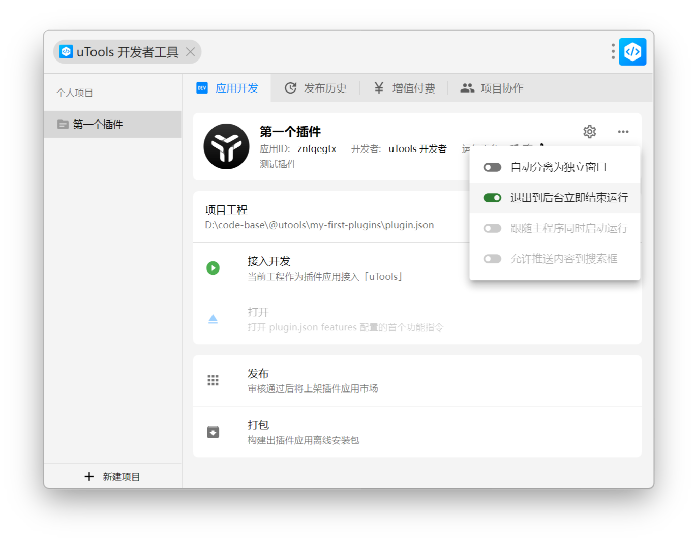
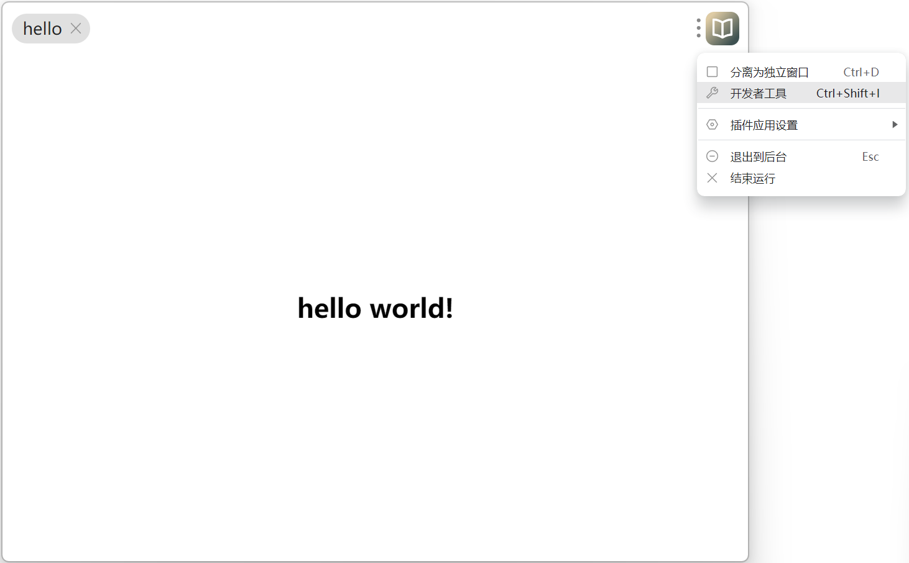

> 来源：[调试插件应用 | uTools 开发者文档](https://www.u-tools.cn/docs/developer/basic/debug-plugin.html)

# 调试插件应用

## 每次进入插件应用加载最新代码
在项目的应用开发界面，点击右上角设置图标弹出的菜单中选择开启 退出到后台立即结束运行
退出到后台立即结束运行

## 使用开发者调试工具
进入开发中的插件应用后，点击右上角应用 Logo - 点击 开发者工具 或者按快捷键 `Ctrl` + `Shift` + `I` 打开
菜单启动开发者工具

## 进阶(代码热更新)
在开发模式下，入口文件是支持 URL 协议的，可配合 Vite、Webpack 等工具，在开发阶段进行热更新。

### Vite
Vite 默认为各种框架提供了热更新的集成，所以只需要默认启动项目既可使用。
1. 启动项目

shell
```
npm run dev
```

1. `plugin.json`增加`development`配置, 端口需要与 webpack-dev-server 开启的端口一致

json
```
{
"development": {
"main": "http://127.0.0.1:5173/index.html"
}
}
```

1. 进入 uTools 开发工具, 点击接入开发后观察效果

### Webpack
1. 添加 Webpack HMR 模块热替换插件

shell
```
npm install webpack-dev-server --save-dev
```

1. 入口`index.js`文件增加监听代码

```
if (module.hot) {
module.hot.accept();
}
```

1. 启动 webpack-dev-server

json
```
//package.json script
"scripts": {
"serve": "webpack serve",
}
```

shell
```
npm run serve
```

1. `plugin.json`增加`development`配置, 端口需要与 webpack-dev-server 开启的端口一致

json
```
{
"development": {
"main": "http://127.0.0.1:8080/index.html"
}
}
```

1. 进入 uTools 开发工具, 点击接入开发后观察效果

注意
preload.js 代码变更后无法自动热更新，在应用开发点击设置开启 退出到后台立即结束运行
