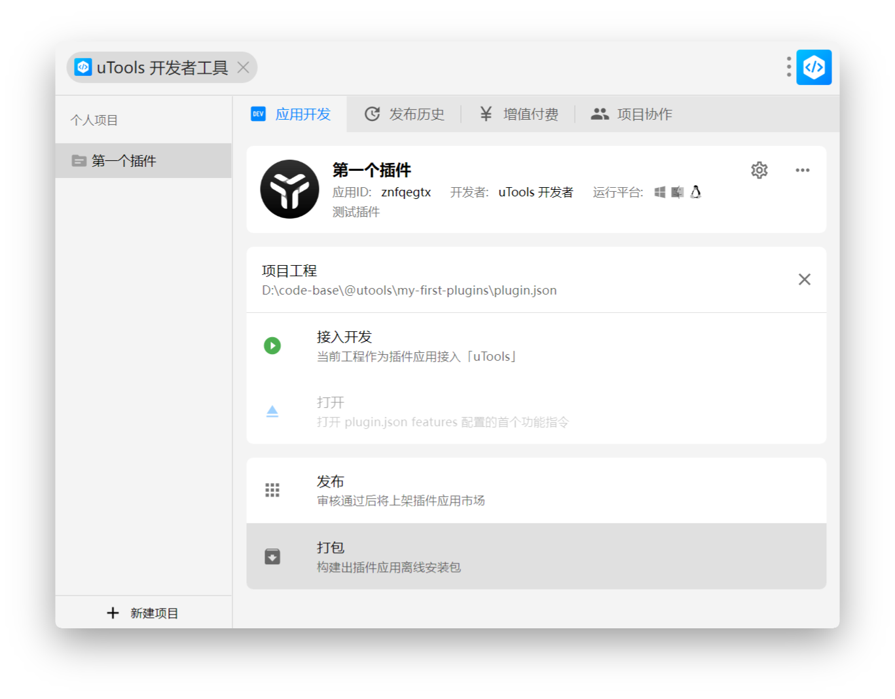
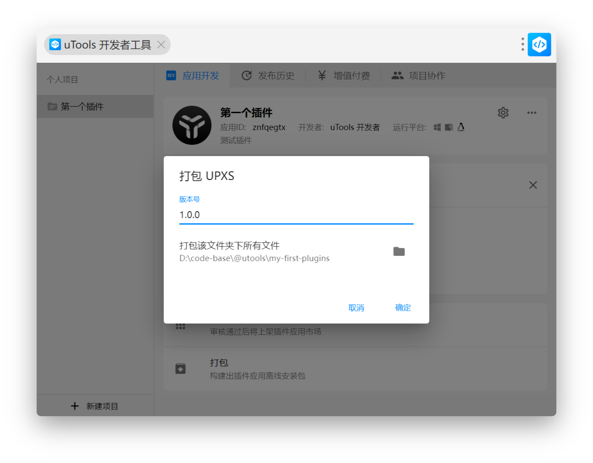

> 来源：[打包为离线安装包 | uTools 开发者文档](https://www.u-tools.cn/docs/developer/basic/offline-plugin.html)

# 打包为离线安装包
当你的插件开发完成后，你可以选择将其打包成离线插件安装包（UPXS）。
这种方式下的插件应用，无需通过审核即可分享给其他人使用，不过在安装时会被 uTools 弹出安全提示，需要用户确认安装。
注意
离线插件应用安装更多用于方便测试或者自己内部分享或使用，而不是用于发布。
若想要更多人使用你的插件应用，请参考 [发布插件应用](basic__publish-plugin.md)。

## 离线安装包
通过 uTools 开发者工具插件，点击 打包 按钮
开发者工具
点击后，会弹出 打包 窗口，填写版本信息后，点击 确认 按钮后，在弹出的文件保存窗口选择保存路径即可完成打包。
打包UPXS文件
WARNING
插件应用打包与发布时，都需要填写对应的版本号，这两个版本号并没有关联。
版本号遵守 [semver 部分规范](https://semver.org/lang/zh-CN/) ，在修改过程中要注意确认。
